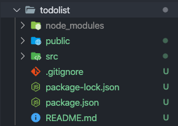
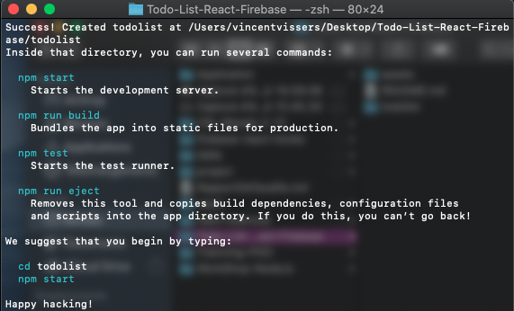
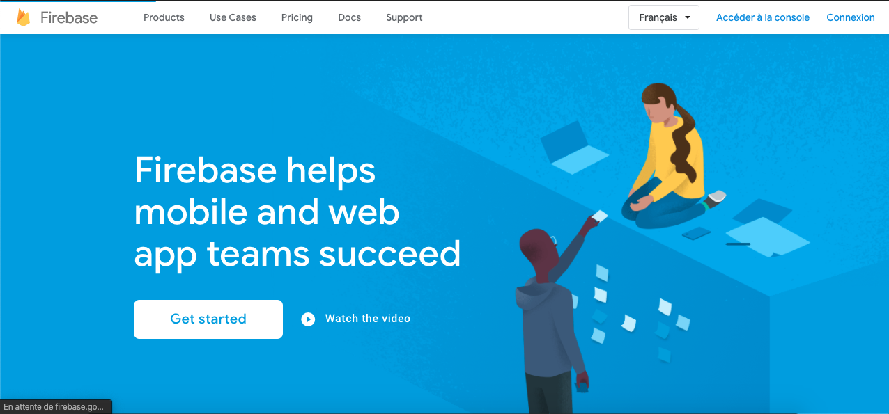
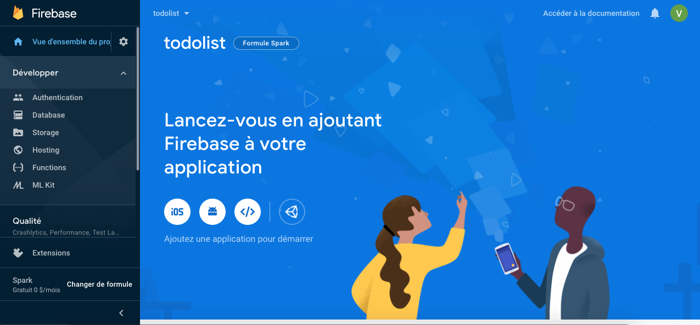

# Todo-List-React-Firebase
Apprentissage de React et Firebase

## Prérequis

- React déja installer sur votre ordinateur
- un compte firebase (100% gratuit)

## Préparation

Tout dabord créé votre application react 
```

$ npx create-react-app todolist 

```
(ATTENTION react n'accepte pas le uppercase pour le nom de votre application)

unefois l'installation terminé voici ce que votre terminal vous dira 



et vous devriez avoir ceci dans votre dossier

 


Ensuite il vous faut installer le module Firebase afin de pouvoire ce connecter a la base de donnée 

```
$ cd todolist

$ npm install firebase

```

**Félicitation!** Firebase est maintenant installer dans react vous etes tres fort ! Mais malheureusement pour vous ce n'et pas encore fini :)
<hr>

## Preparer Firebase

Maintenant il nous faut preparer la base de donnée afin que nos info puisse etre stocker

pour cela rendeez vous sur [Firebase](https://firebase.google.com/)



connecter vous avec votre compte google pour cela il faut cliqué sur "**connexion**", une fois connecter cliqué sur "**Accéder à la console**" vous arriverez sur la page qui repertorie tout vos project

- Créé un nouveau project 
- Nommé le todolist
- Laisse google analytics
- Pour la config de google Analytic selectionner simplement le default compte 

Voila appuyer sur créé :) 

nous voila sur cette jolie page ! 



Nous nous retrouverons lors du petit whorkshop, auquel je vous expliquerait les differente fonctionnalité.